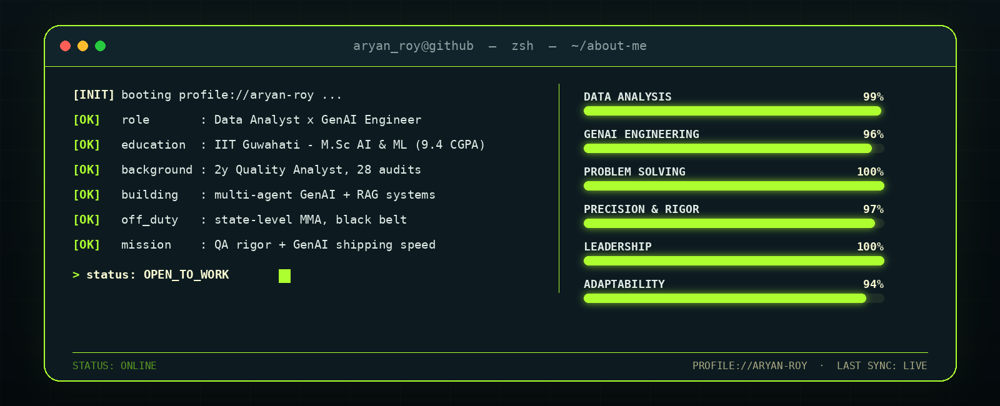

 

## About Me

## Tech Stack

### Languages & Frameworks

### Libraries & Data Science

### Databases

### Cloud & Deployment

### Data Analysis & Statistics

### BI & Reporting

### Generative AI

### Design & Creative Tools

### Tools

</td></tr>
</table>

## Featured Projects

<table width="100%">
<tr>
<td width="50%" valign="top">

**AI Market Research & Strategy Engine**
*React · Vite · Tailwind CSS · REST API · Vercel — Sept 2026*

A multi-agent AI system that turns a research question into a decision-ready, evidence-backed report.

  

- Real-time animated progress UI tracking every stage — no blind loading states
- Tabbed **Report / Evidence / Sources** viewer for one-click traceability
- Engineered the data pipeline behind both the speed and reliability gains

   

</td>
<td width="50%" valign="top">

**NYC Booking Analysis**
*Python · Pandas · EDA · Time Series — Aug 2025*

End-to-end exploratory analysis across **20,000+ listings, 10+ NYC-area cities**.

  

- Systematic cleaning/preprocessing pipeline built for reliability at scale
- Time-series + regional analysis surfacing seasonal pricing patterns
- Flagged high-risk regions to directly inform cancellation policy

  

</td>
</tr>
</table>

## GitHub Activity

  
  

  

If you're building with data and AI, I'd love to talk.

